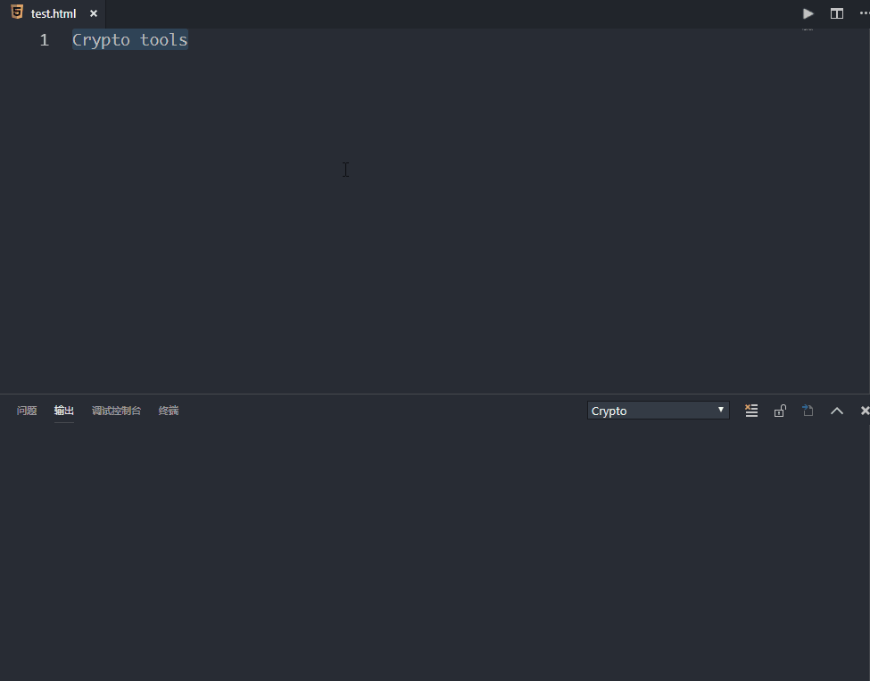
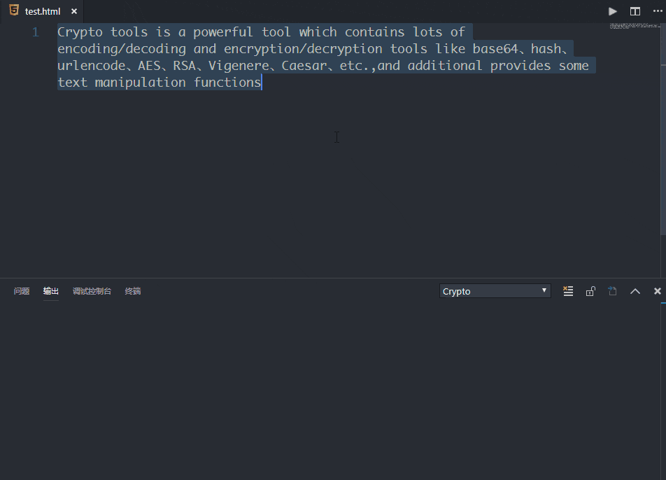
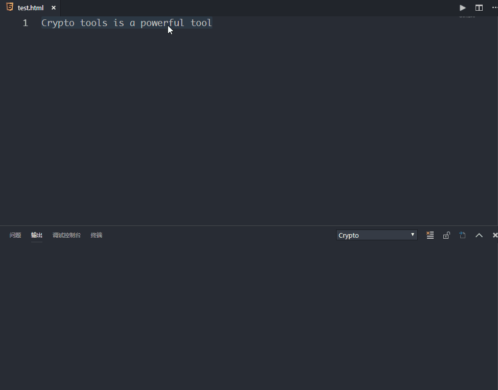
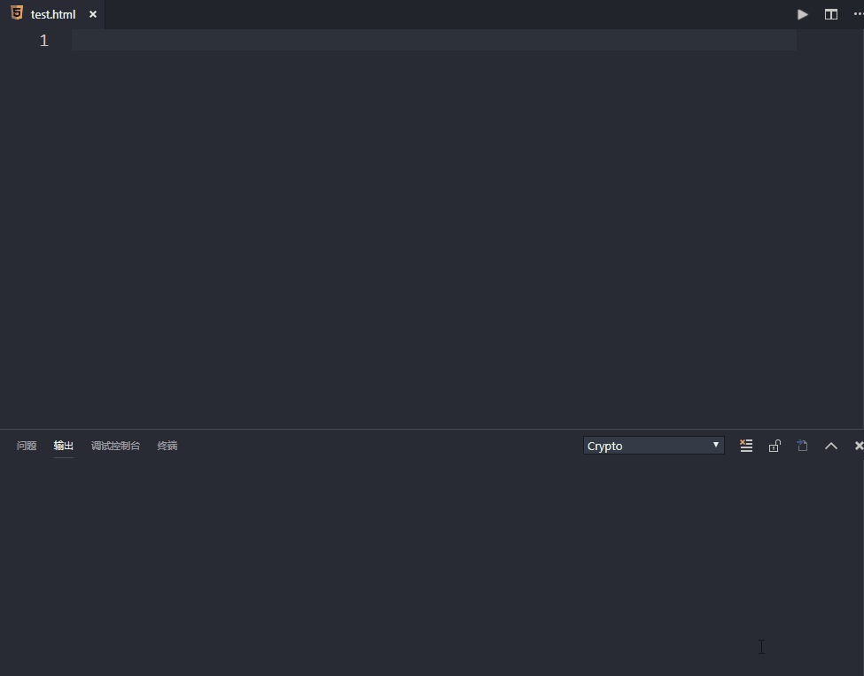

# Crypto Tools

Crypto tools is a powerful tool which contains lots of encoding/decoding and encryption/decryption tools like base64、hash、urlencode、AES、RSA、Vigenere、Caesar、etc.,and additional provides some text manipulation functions

## Features

> Coding/Decoding

- base16/32/64
- MD5/SHA512
- Url Encode
- Html Entitles
- ROT13
- Quote-Printable
- Bubble Babble
- Brainfuck Interpreter
- Number/Hex/Bin and String Conversion



> Encryption/Decryption

- Symmetric Encryption (AES/DES/RC4/etc.)
- RSA Encryption
- Caesar Cipher
- Vigenere Cipher and Guess Key 
- Fence Cipher
- Morse Code
- Cracking Hashes online



> Text Manipulation

- Reverse String
- All Upper/Lower Case
- Title Case
- Strip
- Space to Line/None
- Convert / and \
- Get String Length
- Add Quote For Each Word



> Hexadecimal Calculator

- Simple Hexadecimal Calculator



>Solve the Conflicts with Output Colorizer extension

- Combine the syntaxes files for each installed output colorizer extension

## Requirements

Crack hashes online based on HashBuster,so you need to install python and related libraries 

python2:

```
pip install requests futures
```

python3:

```
pip install requests
```

## Usage

Active the extension as follows:

- Ctrl + shift + P, then just type `crypto` to find the command
- Select a text, then right click to find the command
- Use keybindings when a text has been selected


Default keybindings:

- `Encode/Decode:`          ctrl+alt+d when editorHasSelection
- `Encrypt/Decrypt:`        ctrl+alt+a when editorHasSelection
- `Text Manipulation:`      ctrl+alt+t when editorHasSelection
- `Hexadecimal Calculator:` ctrl+alt+c

You can change it by yourself

## Known Issues

Submit the [issues](https://github.com/fofolee/vscode-crypto-tools/issues) if you find any bug or have any suggestion.

## Release Notes

### 0.0.2

- Solve the Conflicts with Output Colorizer extension

- bug fixes

### 0.0.1

Initial release
